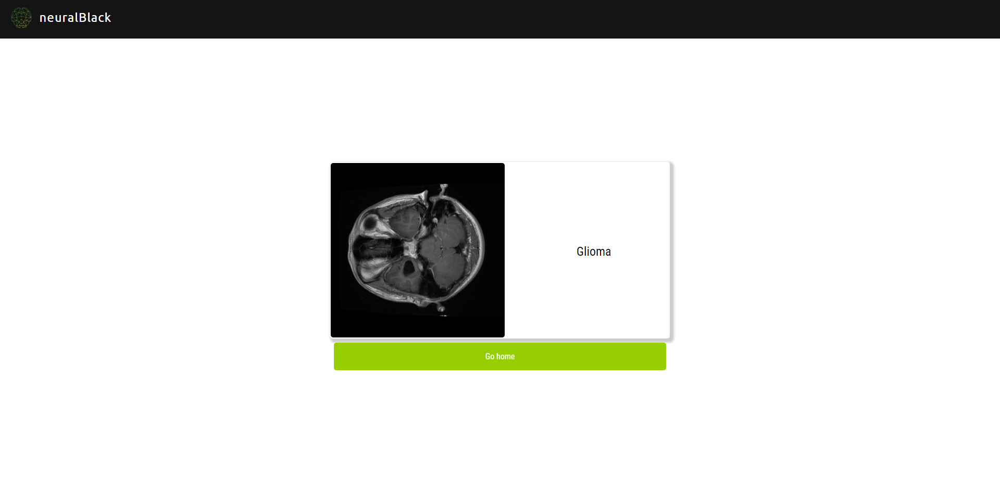
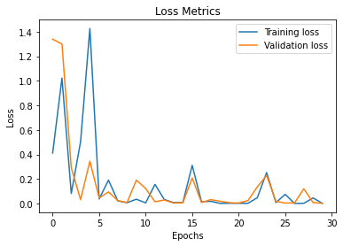
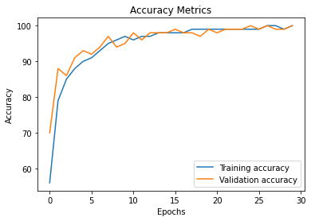

# Brain Tumor Detection 

> **Developed by Srishti Bisht • June 2025**  
> Pioneering an end-to-end AI solution—from data preprocessing to real-time diagnosis—to empower radiologists with quick, accurate insights.

---

## 🌟 Synopsis
NeuralBlack applies deep transfer learning and robust data augmentation to classify brain MRI scans into four classes:

- **Glioma Tumor**
- **Meningioma Tumor**
- **Pituitary Tumor**
- **No Tumor**

**Key Outcomes:**
- **99.3% overall accuracy** on held-out test data  
- Production-ready **Flask API** for instantaneous image inference  
- Fully documented **Jupyter Notebook** pipeline covering EDA, training, and evaluation  

---
## Screenshots (Results & Web Interface)

### Web Interface

#### Home Page


#### Classification Results via Web Interface





### Classifier Evaluation

#### Loss Graph



#### Accuracy Graph



#### Confusion Matrix on Test set


## Requirements

Python 3 is required.

### Library Requirements

We'll be using the following libraries to complete our classification problem:

* **Numpy** - For linear algebra operations
* **Torch** - Pytorch Deep Learning Framework
* **OS** - To use Operating System methods
* **Random** - To set random seed at specific places where random operations take place just so it happens the same way everytime it is executed
* **Pandas** - To create DataFrame, CSV files, etc
* **Time** - To perform date time operations
* **Seaborn** - For sophisticated visualization
* **Pickle** - To save and load binary files of our training data
* **Scikit-Learn** - Machine learning framework. We have used this for evaluating our Classifier and for cross-validation split
* **Matplotlib** - To visualize images, losses and accuracy
## 📦 Core Components

| Module                         | Description                                                      |
|--------------------------------|------------------------------------------------------------------|
| `notebooks/`                   | Interactive analysis and model-building (`training_pipeline.ipynb`) |
| `scripts/train.py`             | Data loading, augmentation, and training routines                |
| `scripts/inference.py`         | CLI tool for single-image predictions                            |
| `scripts/app.py`               | Flask server exposing `/predict` endpoint                        |
| `models/bt_resnet50_model.pt`  | Pretrained model weights                                         |
| `test_images/`                 | Sample MRI scans for quick tests                                 |
| `Dockerfile`                   | Containerization configuration                                   |

---

## 🔧 Installation & Quickstart

1. **Clone & enter project**  
   ```bash
   git clone https://github.com/Srishtiaideveloper/desktop-tutorial.git
   cd desktop-tutorial

